<p align="center">
 
</p>

<div align="center">
  <a href="https://uni-medical.github.io/UniMedVL_Web/" target="_blank">
    
  </a>
  <a href="https://huggingface.co/General-Medical-AI/UniMedVL" target="_blank">
    
  </a>
</div>

<div align="center">
  <a href="https://github.com/uni-medical/UniMedVL" target="_blank">
    
  </a>
  <a href="https://arxiv.org/abs/2510.15710" target="_blank">
    
  </a>
</div>

<p align="center">
  <a href="https://github.com/uni-medical/UniMedVL"><b>🌟 Github</b></a> |
  <a href="https://huggingface.co/General-Medical-AI/UniMedVL"><b>📥 Model Download</b></a> |
  <a href="https://arxiv.org/abs/2510.15710"><b>📄 Paper Link</b></a> |
  <a href="https://uni-medical.github.io/UniMedVL_Web/"><b>🌐 Project Page</b></a>
</p>

<h1>
<p align="center">
  UniMedVL: Unifying Medical Multimodal Understanding and Generation through Observation-Knowledge-Analysis
</p>
</h1>

<p align="center">
  <b>A unified medical foundation model enabling both understanding and generation capabilities within a single architecture</b>
</p>

<p align="center">
 
</p>

## 📚 Introduction

We introduce **UniMedVL**, the unified medical foundation model for seamless multimodal understanding and generation. Four key innovations distinguish UniMedVL:

- **Unified Observation-Knowledge-Analysis Architecture:** UniMedVL sets itself apart from prior medical AI models by following a clinically-inspired three-level framework that mirrors how physicians process medical information, enabling both understanding and generation within a single architecture.

- **Versatile Medical Multimodal Capabilities:** UniMedVL supports a broad spectrum of medical tasks, including visual question answering, medical report generation, text-to-medical-image synthesis, cross-modal translation, and virtual staining across 9 imaging modalities.

- **Large-Scale Medical Dataset:** We present UniMed-5M, a comprehensive medical multimodal dataset containing 5.6M+ high-quality samples with three-stage quality verification and expert validation, covering understanding, generation, and interleaved tasks.

- **Superior Performance:** UniMedVL achieves state-of-the-art performance on multiple evaluation datasets, with 75.4% accuracy on SLAKE VQA, 53.5% on PathVQA, and competitive generation quality (96.29 average gFID), setting a new standard in unified medical AI.

<div align="center">
  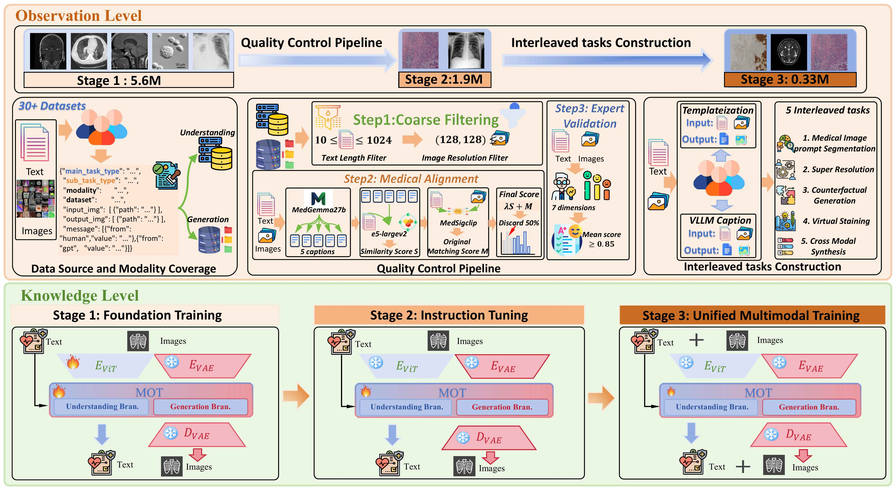
</div>

## 📝 Open-Source Plan

- [x] **📄 Paper & Evaluations** - Research documentation and evaluation results
- [x] **🖼️ Visualizations** - Result figures and model demonstrations
- [x] **💾 Model Checkpoints** - Pre-trained UniMedVL weights (14B parameters)
- [x] **🔧 Inference Code** - Model loading and inference examples
- [ ] **🏋️ Training Code** - Full training pipeline and configuration files
- [ ] **📁 UniMed-5M Dataset** - Training dataset with quality control

## 🔬 Methodology

### 📋 OKA Framework: Observation-Knowledge-Analysis

UniMedVL follows a workflow-guided three-level framework that mirrors how physicians process medical information:

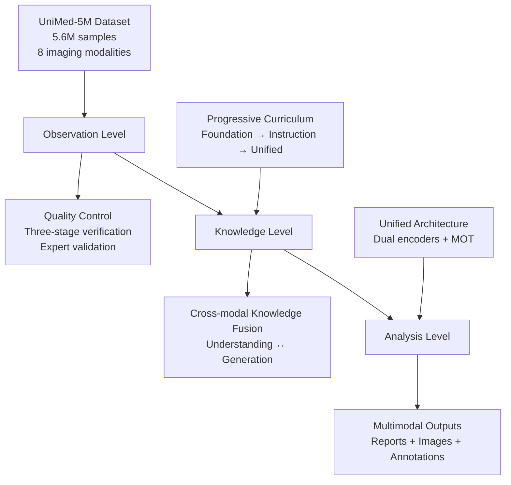

### 🎯 Training Strategy

**Three-Stage Progressive Curriculum Learning:**

1. **🔧 Stage 1 - Foundation Training** (85K steps)
   - Basic medical pattern recognition
   - Visual-language alignment
   - Data ratio: 75% I2T, 25% T2I

2. **📚 Stage 2 - Instruction Tuning** (120K steps)
   - Cross-modal understanding enhancement
   - Medical expertise development
   - Data ratio: 40% I2T, 45% T2I, 10% Interleaved

3. **🚀 Stage 3 - Unified Training** (70K steps)
   - Advanced multimodal synthesis
   - Interleaved task mastery
   - Data ratio: 37% I2T, 35% T2I, 25% Interleaved

---

## 💬 Qualitative Results

Here we present some comprehensive visualization results demonstrating UniMedVL's capabilities. **For additional visualization results and comparisons, please see our [Project Page](https://uni-medical.github.io/UniMedVL_Web/).**

<details open>
  <summary>Performance Across Training Stages</summary>
  <div align="center">
    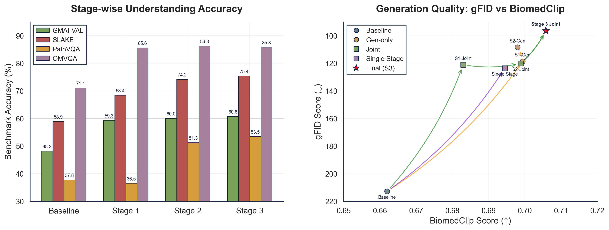
    <p><em>Comprehensive performance comparison across training stages and modalities</em></p>
  </div>
</details>

<details open>
  <summary>Multimodal Tasks Demonstration</summary>
  <div align="center">
    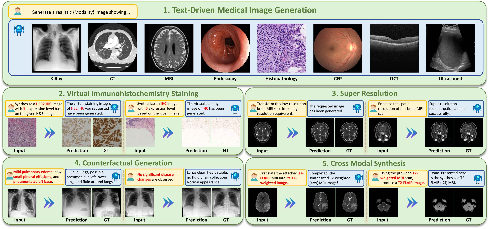
    <p><em>Comprehensive visualization of UniMedVL's multimodal capabilities across diverse medical tasks</em></p>
  </div>
</details>

<details open>
  <summary>Medical Visual Question Answering</summary>
  <div align="center">
    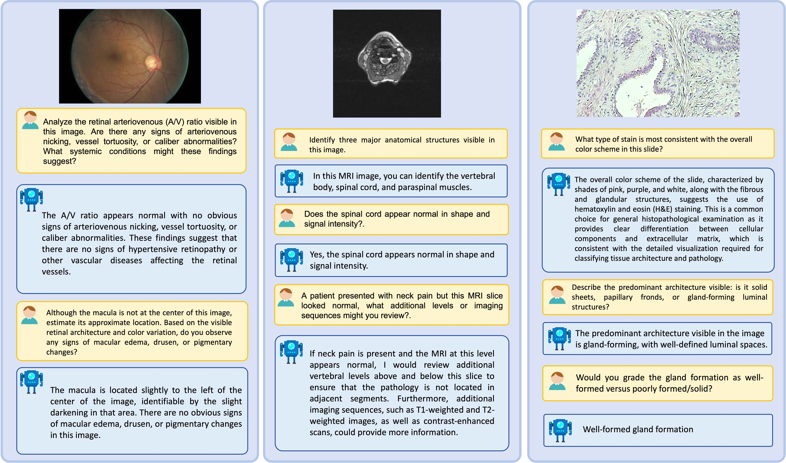
    <p><em>Medical Visual Question Answering examples showing model's diagnostic reasoning capabilities</em></p>
  </div>
</details>

<details open>
  <summary>Medical Report Generation</summary>
  <div align="center">
    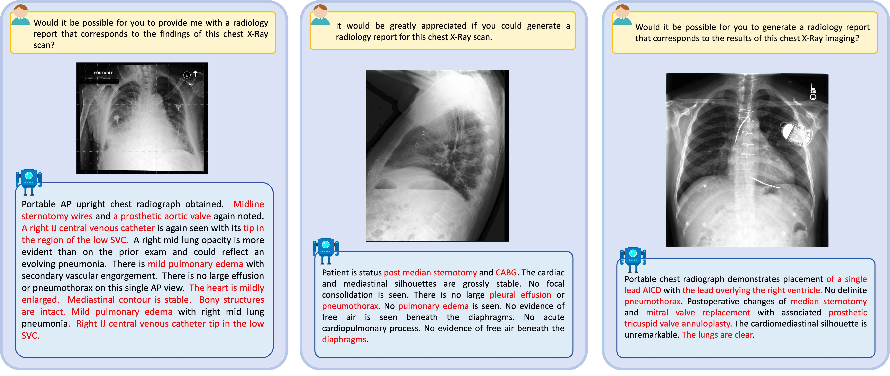
    <p><em>Automated medical report generation examples across different imaging modalities</em></p>
  </div>
</details>

<details open>
  <summary>Text-to-Medical-Image Generation</summary>
  <div align="center">
    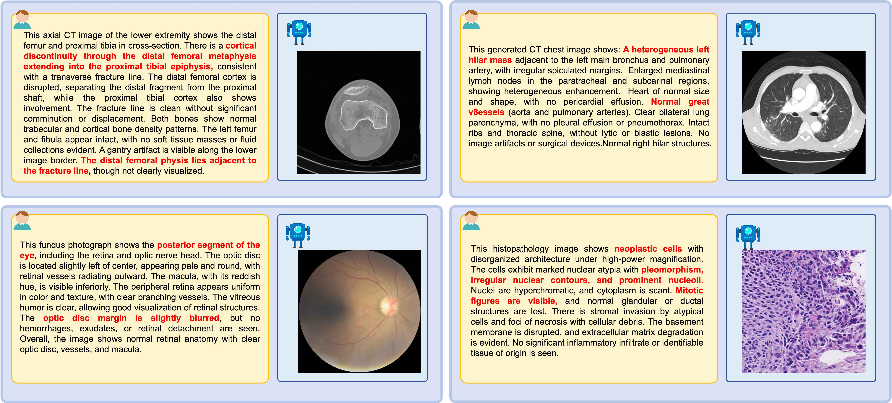
    <p><em>Text-to-medical-image generation results showing high-quality synthesis</em></p>
  </div>
  <div align="center">
    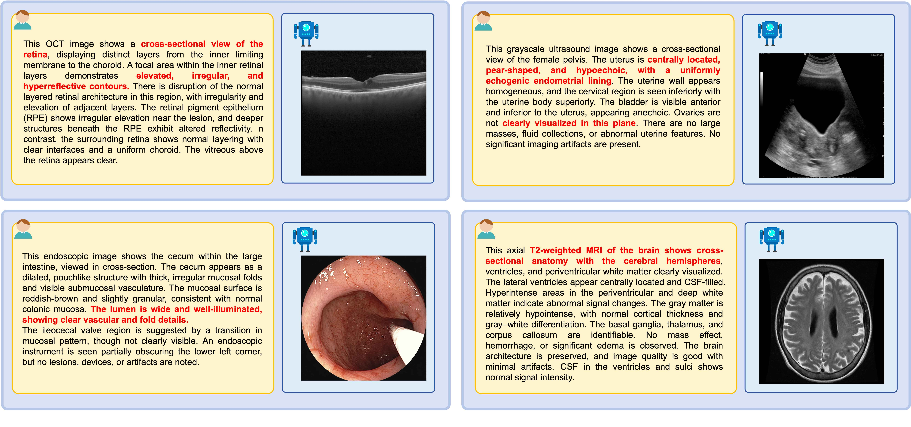
    <p><em>Additional text-to-medical-image generation examples across modalities</em></p>
  </div>
</details>

<details open>
  <summary> Medical-Image Generation across 8 modalities </summary>

 

### Chest X-Ray (CXR)
<div align="center">
  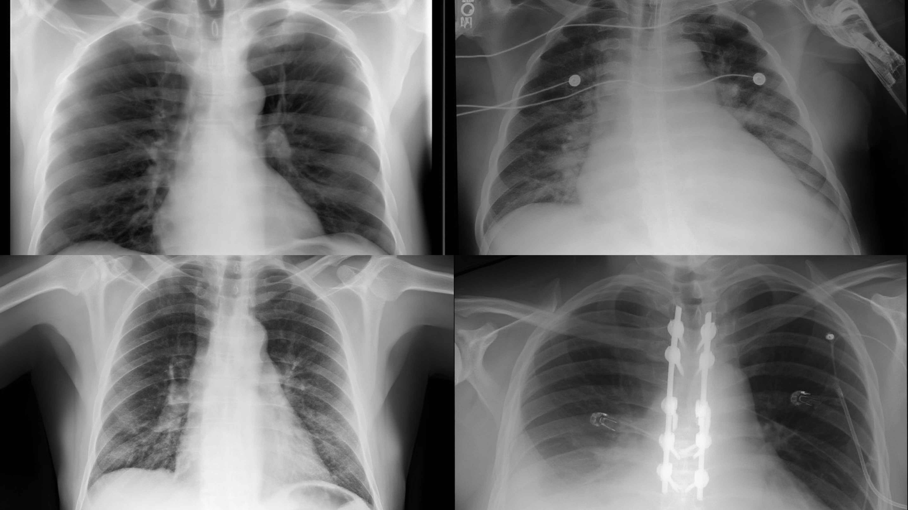
</div>

### Computed Tomography (CT)
<div align="center">
  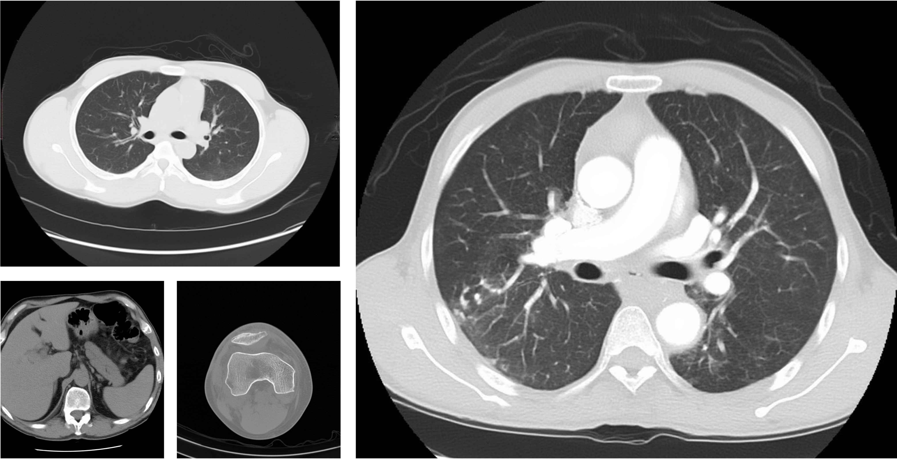
</div>

### Magnetic Resonance Imaging (MRI)
<div align="center">
  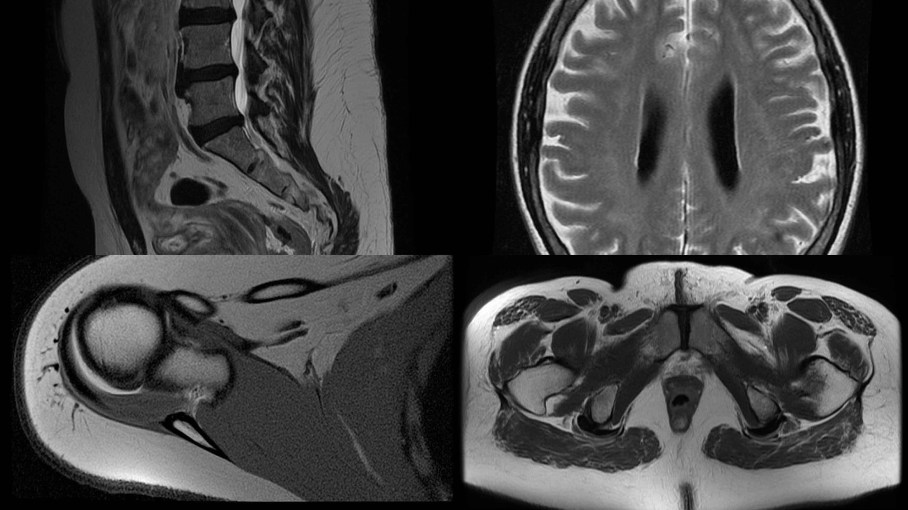
</div>

### Ultrasound
<div align="center">
  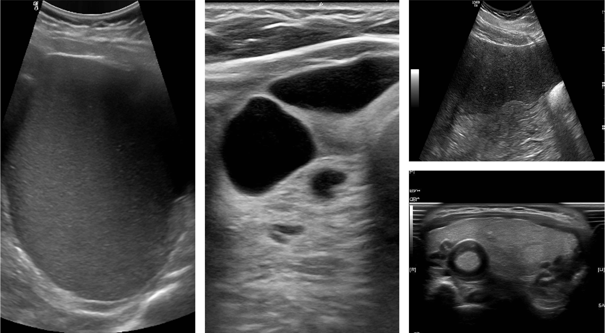
</div>

### Histopathology (HIS)
<div align="center">
  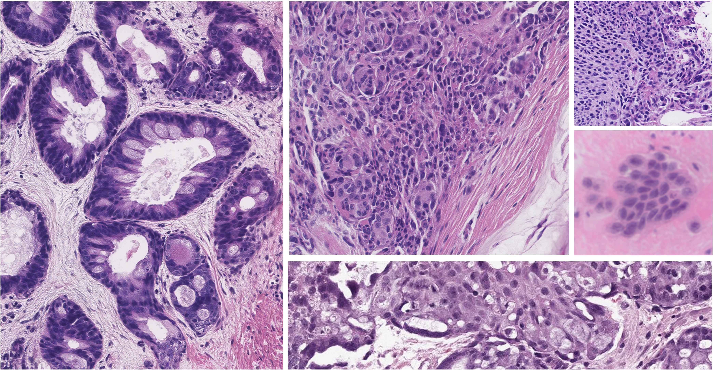
</div>

### Retinal Fundus Photography (CFP)
<div align="center">
  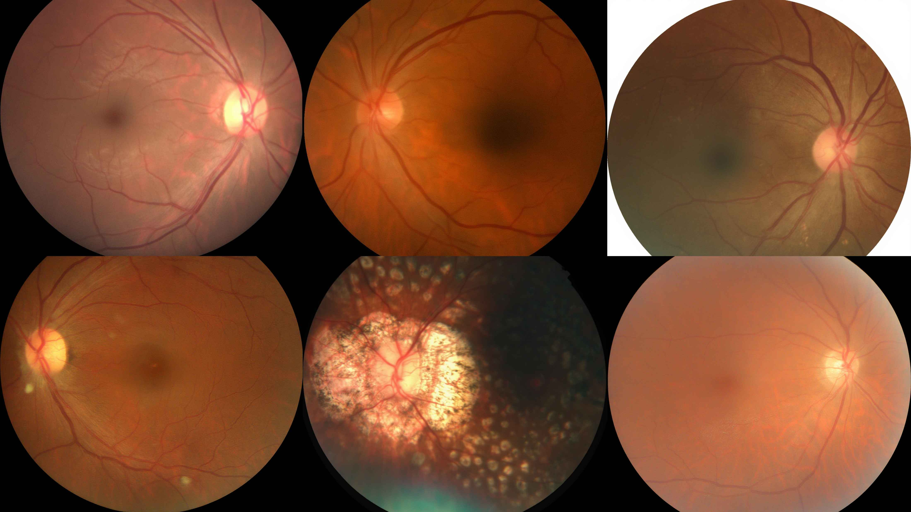
</div>

### Optical Coherence Tomography (OCT)
<div align="center">
  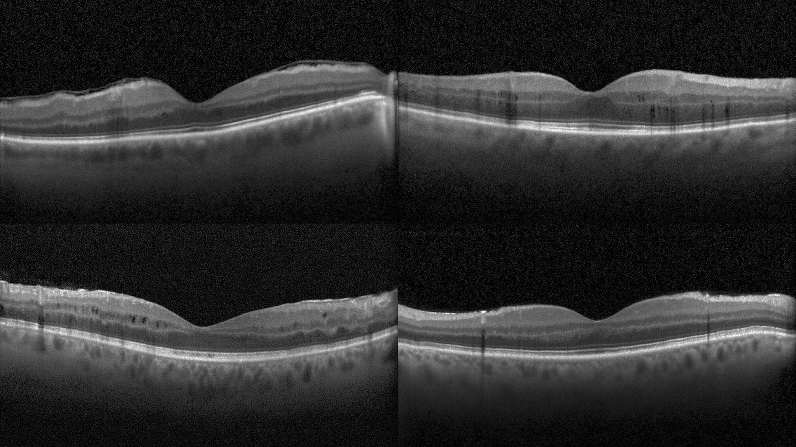
</div>

### Endoscopy
<div align="center">
  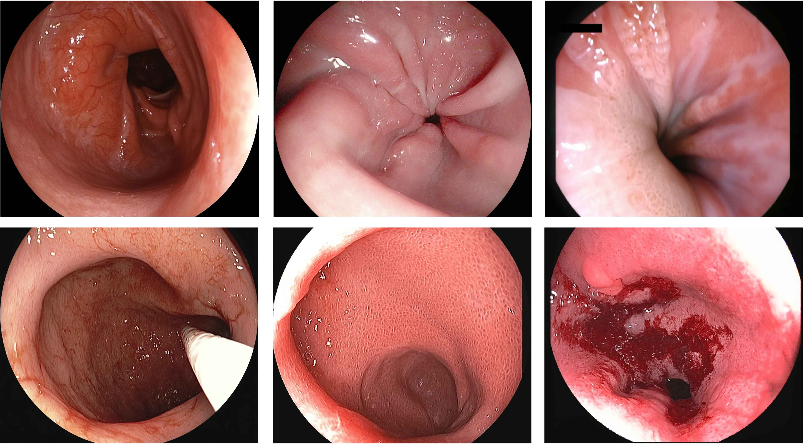
</div>

</details>

## 📊 Quantitative Performance

<details open>
  <summary>Medical Visual Question Answering Performance</summary>

| Model | Params | Type | VQA-RAD | SLAKE | PathVQA | OmniMedVQA | GMAI-MMBench |
|-------|--------|------|---------|-------|---------|------------|--------------|
| GMAI-VL | 7B | Medical-specific | 66.3 | 72.9 | 39.8 | 88.5 | 61.74 |
| HuatuoGPT-Vision | 7B | Medical-specific | 53.0 | 49.1 | 32.0 | 50.0 | 50.22 |
| Bagel | 7B | Unified | 60.09 | 58.91 | 39.05 | 71.13 | 48.11 |
| HealthGPT-L14 | 14B | Unified | 58.3 | 64.5 | 44.4 | 74.4 | 43.1 |
| **UniMedVL** | **14B** | **Unified** | **61.9** | **75.4** | **53.5** | **85.8** | **60.75** |

</details>


<details open>
  <summary>Medical Image Generation Performance</summary>

*Text-to-image generation performance across 8 medical imaging modalities. Metrics: gFID ↓ (lower is better) / BioMedCLIP Score ↑ (higher is better)*

| Model | CFP | CXR | CT | HIS | MRI | OCT | Ultrasound | Endoscopy | Average |
|-------|-----|-----|----|----|-----|-----|------------|-----------|---------|
| Bagel (7B) | 217.19/0.650 | 182.80/0.662 | 163.78/0.652 | 206.18/0.643 | 175.74/0.639 | 307.80/0.719 | 255.78/0.672 | 214.61/0.668 | 215.49/0.660 |
| **UniMedVL (14B)** | **53.20/0.708** | **73.04/0.702** | **73.04/0.696** | **149.01/0.704** | **90.36/0.706** | **99.27/0.721** | **95.38/0.706** | **133.11/0.707** | **96.29/0.706** |

</details>

<details open>
  <summary>Interleaved Multimodal Tasks Performance</summary>

**Virtual Immunohistochemistry Staining (H&E → IHC)**

| Method | Type | PSNR ↑ | SSIM ↑ |
|--------|------|--------|--------|
| Pyramid Pix2pix | Specialized | 21.16 | 0.477 |
| HealthGPT-M3 | Unified | 15.81 | 0.242 |
| **UniMedVL** | **Unified** | **20.27** | **0.456** |

**MRI Super-Resolution (4× upsampling)**

| Method | Type | PSNR ↑ | SSIM ↑ |
|--------|------|--------|--------|
| AMIR | Specialized | 31.99 | 0.939 |
| HealthGPT-M3 | Unified | 18.37 | 0.580 |
| **UniMedVL** | **Unified** | **27.29** | **0.890** |

**Cross-Modal Synthesis (T2 ↔ FLAIR MRI)**

| Method | Type | Average PSNR ↑ | Average SSIM ↑ |
|--------|------|----------------|----------------|
| ResViT | Specialized | 25.38 | 0.889 |
| HealthGPT-M3 | Unified | 19.09 | 0.748 |
| **UniMedVL** | **Unified** | **25.07** | **0.882** |

</details>

<details open>
  <summary>Counterfactual Medical Image Generation</summary>

*Performance on counterfactual chest X-ray generation with explanatory text. † indicates unified fine-tuning variant.*

| Method | gFID ↓ | AUROC ↑ | F1 ↑ | BLEU-3 ↑ | METEOR ↑ | ROUGE-L ↑ |
|--------|--------|---------|------|----------|----------|-----------|
| ProgEmu | 29.21 | 0.792 | 0.891 | 0.124 | 0.410 | 0.261 |
| **UniMedVL†** | **27.17** | **0.797** | **0.873** | **0.264** | **0.449** | **0.465** |

</details>


---

## 🚀 Getting Started

### Installation
```bash
conda env create -f codes/environment.yaml
conda activate unimedvl
```

### Inference Scripts
Two interactive inference scripts are provided in the `codes/` directory:

1. **Medical Visual Question Answering** (`interactive_vqa_inferencer.py`)

2. **Medical Image Generation** (`interactive_image_generator.py`)

### Quick Usage
1. Download the UniMedVL checkpoint 
2. Set `model_path` and `ROOT` in the script configuration
3. Run the script: `python codes/interactive_vqa_inferencer.py` or `python codes/interactive_image_generator.py`


---

## 📜 License

This project is licensed under the **Apache License 2.0**. See the [LICENSE](LICENSE) file for details.

---

## 📚 Citations

If you use this project in your research or work, please cite it as:

```bibtex
 @misc{ning2025unimedvlunifyingmedicalmultimodal,
      title={Unimedvl: Unifying Medical Multimodal Understanding And Generation Through Observation-Knowledge-Analysis}, 
      author={Junzhi Ning and Wei Li and Cheng Tang and Jiashi Lin and Chenglong Ma and Chaoyang Zhang and Jiyao Liu and Ying Chen and Shujian Gao and Lihao Liu and Yuandong Pu and Huihui Xu and Chenhui Gou and Ziyan Huang and Yi Xin and Qi Qin and Zhongying Deng and Diping Song and Bin Fu and Guang Yang and Yuanfeng Ji and Tianbin Li and Yanzhou Su and Jin Ye and Shixiang Tang and Ming Hu and Junjun He},
      year={2025},
      eprint={2510.15710},
      archivePrefix={arXiv},
      primaryClass={cs.CV},
      url={https://arxiv.org/abs/2510.15710},
}
```

---

## 🙏 Acknowledgments

We sincerely thank the following projects and their contributors for their invaluable open-source contributions that made this research possible:

- **[Bagel](https://github.com/ByteDance-Seed/Bagel)** - Foundation model architecture and training methodology inspiration
- **[HealthGPT](https://github.com/DCDmllm/HealthGPT)** - Medical domain adaptation and evaluation framework
- **[VLMEvalKit](https://github.com/open-compass/VLMEvalKit)** - Comprehensive evaluation toolkit for vision-language models
