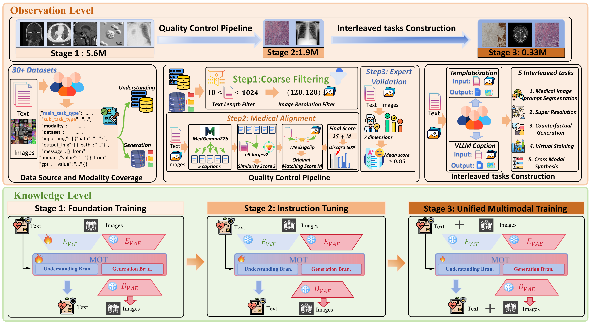
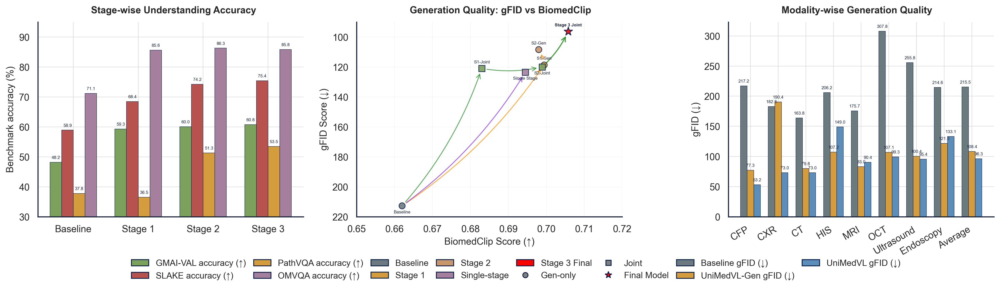
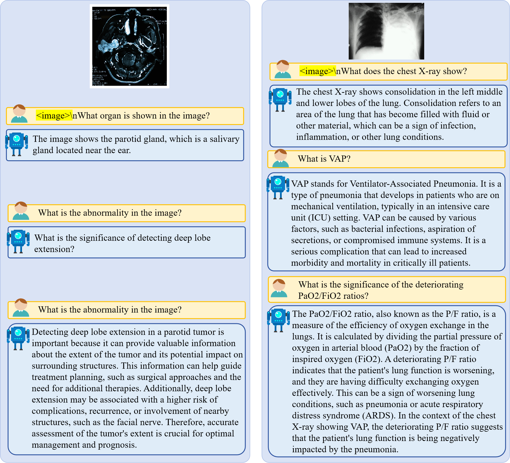
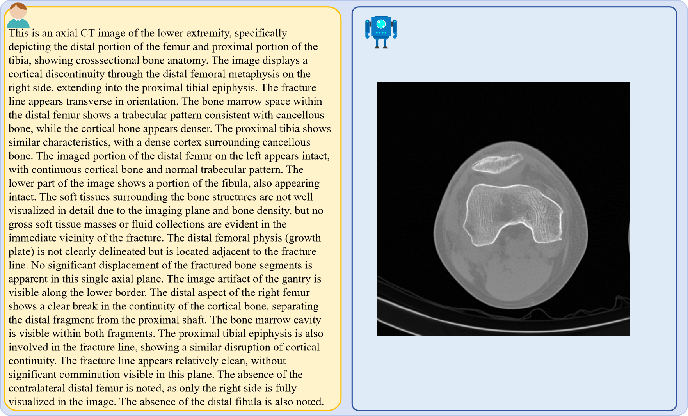
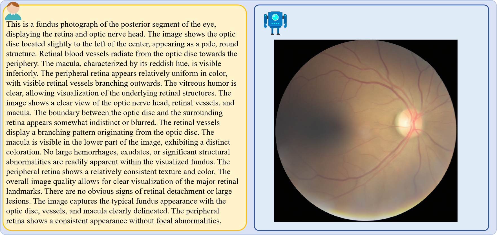

# UniMedVL: An Observation-Knowledge-Analysis Oriented Medical Unified Multimodal Understanding 
and Generation Model

*A unified medical foundation model enabling both understanding and generation capabilities within a single architecture*

## 🌟 Overview

**UniMedVL** is the first unified medical foundation model that achieves **both understanding and generation** capabilities within a single architecture, enabling seamless multimodal processing across diverse medical imaging tasks.

### ✨ Key Features

- **🔬 Unified Architecture**: Single model handles understanding (VQA, report generation) and generation (image synthesis, cross-modal translation)
- **📊 Large-Scale Dataset**: UniMed-5M dataset with 5+ million medical samples across 9 imaging modalities
- **🎯 SOTA Performance**: 75.40% accuracy on SLAKE, 53.46% on PathVQA, competitive generation quality (96.29 average gFID)
- **🏥 Clinical Workflow**: Follows Observation-Knowledge-Analysis (OKA) paradigm mirroring real clinican learning.
- **⚡ Progressive Training**: Three-stage curriculum learning for systematic cross-modal knowledge fusion

## 🔬 Methodology

### 🎯 Overview Architecture

  
  
<em>Figure 1: UniMedVL unified framework overview showing capabilities across medical image understanding and generation tasks</em>

  
<strong>Note:</strong> <a href="images/teaser.png">View full-resolution figure</a>

---

### 📋 OKA Framework: Observation-Knowledge-Analysis

UniMedVL follows a clinical workflow-guided three-level framework that mirrors how physicians process medical information:

### 📊 Data Pipeline and Architecture

  
  
<em>Figure 2: Comprehensive data processing pipeline and model architecture overview</em>

  
<strong>Note:</strong> <a href="images/overview_ver3.png">View full-resolution figure</a>

### 🎯 Training Strategy

**Three-Stage Progressive Curriculum Learning:**

1. **🔧 Stage 1 - Foundation Training** (85K steps)
   - Basic medical pattern recognition
   - Visual-language alignment
   - Data ratio: 75% I2T, 25% T2I

2. **📚 Stage 2 - Instruction Tuning** (120K steps)
   - Cross-modal understanding enhancement
   - Medical expertise development
   - Data ratio: 40% I2T, 45% T2I, 10% Interleaved

3. **🚀 Stage 3 - Unified Training** (70K steps)
   - Advanced multimodal synthesis
   - Interleaved task mastery
   - Data ratio: 37% I2T, 35% T2I, 25% Interleaved

---

## 📊 Experimental Results

### 📊 Performance Visualization

  
  
<em>Figure 3: Comprehensive performance comparison across training stages and modalities</em>

### 🔄 Multimodal Tasks Demonstration

  
  
<em>Figure 4: Comprehensive visualization of UniMedVL's multimodal capabilities across diverse medical tasks</em>

  
<strong>Note:</strong> <a href="images/fig_results_ver2.png">View full-resolution figure</a>

### 💬 Medical Visual Question Answering

  
  
<em>Figure 5: Medical Visual Question Answering examples showing model's diagnostic reasoning capabilities</em>

### 📄 Medical Report Generation

  
  
<em>Figure 6: Automated medical report generation examples across different imaging modalities</em>

### 🎨 Text-to-Medical-Image Generation

  
  
<em>Figure 7: Text-to-medical-image generation results showing high-quality synthesis</em>

  
  
<em>Figure 8: Additional text-to-medical-image generation examples across modalities</em>

## 📁 UniMed-5M Dataset

### 📈 Dataset Statistics

UniMed-5M is a comprehensive medical multimodal dataset containing **5.6M+ samples** across diverse medical imaging modalities and task types.

**Dataset Composition by Training Stage:**

| Stage | Tasks | Datasets | Total Samples | Purpose |
|-------|-------|----------|---------------|---------|
| **Stage 1** | Foundation | 35 | **5.6M** | Basic medical understanding |
| **Stage 2** | Instruction | 15 | **1.9M** | Cross-modal knowledge fusion |
| **Stage 3** | Unified | 21 | **0.33M** | Advanced interleaved tasks |
| **Total** | - | **77** | **7.8M** | Complete medical AI training |

**Training Data Composition:**

- **Understanding Tasks** (60%): VQA, Report generation, Image captioning
- **Generation Tasks** (30%): Text-to-image, Controllable synthesis
- **Interleaved Tasks** (10%): Virtual staining, Cross-modal translation, Super-resolution

### ✨ Key Dataset Features

1. **🌍 Comprehensive Coverage**: 9 medical imaging modalities
2. **🎯 Task Diversity**: Understanding + Generation + Interleaved tasks
3. **🔬 Quality Assurance**: Three-stage verification with expert validation
4. **📏 Large Scale**: 5.6M+ high-quality medical samples
5. **🏥 Clinical Relevance**: Real-world medical scenarios and workflows

---

### 🎨 VAE Reconstruction Quality

  
  
<em>Figure 9: Qualitative comparison of VAE reconstruction quality across diverse medical imaging modalities</em>

---

## 🚀 Release Timeline

**Note**: This project is currently under anonymous review. Resources will be released upon paper acceptance.

### 📅 Release Checklist

- [x] **📄 Paper & Benchmarks** - Research documentation and evaluation results
- [x] **🖼️ Visualizations** - Result figures and model demonstrations
- [ ] **💾 Model Checkpoints** - Pre-trained UniMedVL weights (14B)
- [ ] **🔧 Inference Code** - Model loading and basic usage examples
- [ ] **📁 UniMed-5M Dataset** - Training dataset with quality control
- [ ] **🏋️ Training Code** - Complete training pipeline and configs

---

## 📜 License and Citation

**Note**: This project is currently under anonymous review. Code, model weights, and dataset will be released upon paper acceptance.

---

## 🙏 Acknowledgments

We sincerely thank the following projects and their contributors for their invaluable open-source contributions that made this research possible:

- **[Bagel](https://github.com/ByteDance-Seed/Bagel)** - Foundation model architecture and training methodology inspiration
- **[HealthGPT](https://github.com/DCDmllm/HealthGPT)** - Medical domain adaptation and evaluation framework
- **[REPA-E](https://github.com/End2End-Diffusion/REPA-E)** - End-to-end VAE architecture and diffusion model integration
- **[VLMEvalKit](https://github.com/open-compass/VLMEvalKit)** - Comprehensive evaluation toolkit for vision-language models
