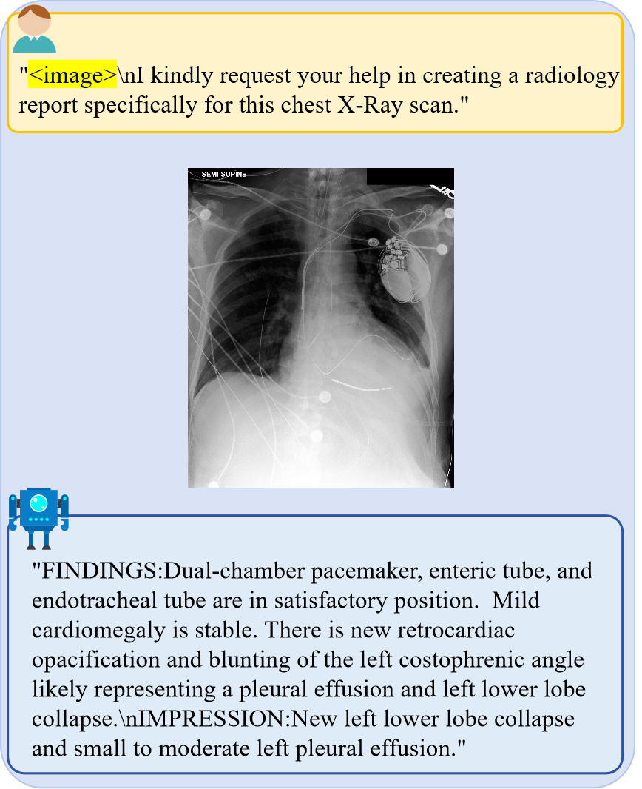

 

 <h1>UniMedVL: Unifying Medical Multimodal Understanding and Generation through Observation-Knowledge-Analysis</h1>

 [[📑 Paper](https://arxiv.org/abs/xxxxx)] (Coming Soon) &emsp; [[🌐 Project Page](https://uni-medical.github.io/UniMedVL_Web/)] &emsp; [[🤗 HuggingFace](https://huggingface.co/UniMedVL)] (Coming Soon)

 <b>*A unified medical foundation model enabling both understanding and generation capabilities within a single architecture*</b>

 

## 📚 Introduction

We introduce **UniMedVL**, the first unified medical foundation model for seamless multimodal understanding and generation. UniMedVL is distinguished by four key innovations:

- **Unified Observation-Knowledge-Analysis Architecture:** UniMedVL sets itself apart from prior medical AI models by following a clinically-inspired three-level framework that mirrors how physicians process medical information, enabling both understanding and generation within a single architecture.

- **Versatile Medical Multimodal Capabilities:** UniMedVL supports a broad spectrum of medical tasks, including visual question answering, medical report generation, text-to-medical-image synthesis, cross-modal translation, and virtual staining across 9 imaging modalities.

- **Large-Scale Medical Dataset:** We present UniMed-5M, a comprehensive medical multimodal dataset containing 5.6M+ high-quality samples with three-stage quality verification and expert validation, covering understanding, generation, and interleaved tasks.

- **Superior Performance:** UniMedVL achieves state-of-the-art performance on multiple benchmarks, with 75.4% accuracy on SLAKE VQA, 53.5% on PathVQA, and competitive generation quality (96.29 average gFID), setting a new standard in unified medical AI.

  

## 📝 Open-Source Plan

- [x] **📄 Paper & Benchmarks** - Research documentation and evaluation results
- [x] **🖼️ Visualizations** - Result figures and model demonstrations
- [ ] **💾 Model Checkpoints** - Pre-trained UniMedVL weights (14B parameters)
- [ ] **🔧 Inference Code** - Model loading and inference examples
- [ ] **📁 UniMed-5M Dataset** - Complete training dataset with quality control
- [ ] **🏋️ Training Code** - Full training pipeline and configuration files
- [ ] **📊 Evaluation Scripts** - Benchmark evaluation and metrics computation
- [ ] **🎯 Demo & Gradio Interface** - Interactive web demo for model testing

## 🔬 Methodology

### 📋 OKA Framework: Observation-Knowledge-Analysis

UniMedVL follows a clinical workflow-guided three-level framework that mirrors how physicians process medical information:

### 🎯 Training Strategy

**Three-Stage Progressive Curriculum Learning:**

1. **🔧 Stage 1 - Foundation Training** (85K steps)
   - Basic medical pattern recognition
   - Visual-language alignment
   - Data ratio: 75% I2T, 25% T2I

2. **📚 Stage 2 - Instruction Tuning** (120K steps)
   - Cross-modal understanding enhancement
   - Medical expertise development
   - Data ratio: 40% I2T, 45% T2I, 10% Interleaved

3. **🚀 Stage 3 - Unified Training** (70K steps)
   - Advanced multimodal synthesis
   - Interleaved task mastery
   - Data ratio: 37% I2T, 35% T2I, 25% Interleaved

---

## 💬 Qualitative Results

Here we present some comprehensive visualization results demonstrating UniMedVL's capabilities. **For additional visualization results and comparisons, please see our [Project Page](https://unimedvl.github.io/).**

  
Performance Across Training Stages

  

    
    
<em>Comprehensive performance comparison across training stages and modalities</em>

  

  
Multimodal Tasks Demonstration

  

    
    
<em>Comprehensive visualization of UniMedVL's multimodal capabilities across diverse medical tasks</em>

  

  
Medical Visual Question Answering

  

    
    
<em>Medical Visual Question Answering examples showing model's diagnostic reasoning capabilities</em>

  

  
Medical Report Generation

  

    
    
<em>Automated medical report generation examples across different imaging modalities</em>

  

  
Text-to-Medical-Image Generation

  

    
    
<em>Text-to-medical-image generation results showing high-quality synthesis</em>

  

  

    
    
<em>Additional text-to-medical-image generation examples across modalities</em>

  

  
 Medical-Image Generation across 8 modalities 

 

### Chest X-Ray (CXR)

  

### Computed Tomography (CT)

  

### Magnetic Resonance Imaging (MRI)

  

### Ultrasound

  

### Histopathology (HIS)

  

### Retinal Fundus Photography (CFP)

  

### Optical Coherence Tomography (OCT)

  

### Endoscopy

  

## 📊 Quantitative Performance

  
Medical Visual Question Answering Benchmarks

| Model | Params | Type | VQA-RAD | SLAKE | PathVQA | OmniMedVQA | GMAI-MMBench |
|-------|--------|------|---------|-------|---------|------------|--------------|
| GMAI-VL | 7B | Medical-specific | 66.3 | 72.9 | 39.8 | 88.5 | 61.74 |
| HuatuoGPT-Vision | 7B | Medical-specific | 53.0 | 49.1 | 32.0 | 50.0 | 50.22 |
| Bagel | 7B | Unified | 60.09 | 58.91 | 39.05 | 71.13 | 48.11 |
| HealthGPT-L14 | 14B | Unified | 58.3 | 64.5 | 44.4 | 74.4 | 43.1 |
| **UniMedVL** | **14B** | **Unified** | **61.9** | **75.4** | **53.5** | **85.8** | **60.75** |

  
Medical Image Generation Benchmarks

*Text-to-image generation performance across 8 medical imaging modalities. Metrics: gFID ↓ (lower is better) / BioMedCLIP Score ↑ (higher is better)*

| Model | CFP | CXR | CT | HIS | MRI | OCT | Ultrasound | Endoscopy | Average |
|-------|-----|-----|----|----|-----|-----|------------|-----------|---------|
| Bagel (7B) | 217.19/0.650 | 182.80/0.662 | 163.78/0.652 | 206.18/0.643 | 175.74/0.639 | 307.80/0.719 | 255.78/0.672 | 214.61/0.668 | 215.49/0.660 |
| **UniMedVL (14B)** | **53.20/0.708** | **73.04/0.702** | **73.04/0.696** | **149.01/0.704** | **90.36/0.706** | **99.27/0.721** | **95.38/0.706** | **133.11/0.707** | **96.29/0.706** |

  
Interleaved Multimodal Tasks Performance

**Virtual Immunohistochemistry Staining (H&E → IHC)**

| Method | Type | PSNR ↑ | SSIM ↑ |
|--------|------|--------|--------|
| Pyramid Pix2pix | Specialized | 21.16 | 0.477 |
| HealthGPT-M3 | Unified | 15.81 | 0.242 |
| **UniMedVL** | **Unified** | **20.27** | **0.456** |

**MRI Super-Resolution (4× upsampling)**

| Method | Type | PSNR ↑ | SSIM ↑ |
|--------|------|--------|--------|
| AMIR | Specialized | 31.99 | 0.939 |
| HealthGPT-M3 | Unified | 18.37 | 0.580 |
| **UniMedVL** | **Unified** | **27.29** | **0.890** |

**Cross-Modal Synthesis (T2 ↔ FLAIR MRI)**

| Method | Type | Average PSNR ↑ | Average SSIM ↑ |
|--------|------|----------------|----------------|
| ResViT | Specialized | 25.38 | 0.889 |
| HealthGPT-M3 | Unified | 19.09 | 0.748 |
| **UniMedVL** | **Unified** | **25.07** | **0.882** |

  
Counterfactual Medical Image Generation

*Performance on counterfactual chest X-ray generation with explanatory text. † indicates unified fine-tuning variant.*

| Method | gFID ↓ | AUROC ↑ | F1 ↑ | BLEU-3 ↑ | METEOR ↑ | ROUGE-L ↑ |
|--------|--------|---------|------|----------|----------|-----------|
| ProgEmu | 29.21 | 0.792 | 0.891 | 0.124 | 0.410 | 0.261 |
| **UniMedVL†** | **27.17** | **0.797** | **0.873** | **0.264** | **0.449** | **0.465** |

---

## 📜 License

**License**: This project is licensed for **academic research purposes only**. Commercial use is **strictly prohibited**.

**Note**: This project is currently under anonymous review. Code, model weights, and dataset will be released upon paper acceptance.

---

## 🙏 Acknowledgments

We sincerely thank the following projects and their contributors for their invaluable open-source contributions that made this research possible:

- **[Bagel](https://github.com/ByteDance-Seed/Bagel)** - Foundation model architecture and training methodology inspiration
- **[HealthGPT](https://github.com/DCDmllm/HealthGPT)** - Medical domain adaptation and evaluation framework
- **[REPA-E](https://github.com/End2End-Diffusion/REPA-E)** - End-to-end VAE architecture and diffusion model integration
- **[VLMEvalKit](https://github.com/open-compass/VLMEvalKit)** - Comprehensive evaluation toolkit for vision-language models
