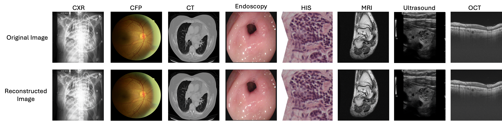

<p align="center">
 
</p>

<div align="center">
 <h1>UniMedVL: Unifying Medical Multimodal Understanding and Generation through Observation-Knowledge-Analysis</h1>

 [[📑 Paper](https://arxiv.org/abs/xxxxx)] (Coming Soon) &emsp; [[🌐 Project Page](https://uni-medical.github.io/UniMedVL_Web/)] &emsp; [[🤗 HuggingFace](https://huggingface.co/UniMedVL)] (Coming Soon)

 <b>*A unified medical foundation model enabling both understanding and generation capabilities within a single architecture*</b>

 
</div>

## 📚 Introduction

We introduce **UniMedVL**, the first unified medical foundation model for seamless multimodal understanding and generation. UniMedVL is distinguished by four key innovations:

- **Unified Observation-Knowledge-Analysis Architecture:** UniMedVL sets itself apart from prior medical AI models by following a clinically-inspired three-level framework that mirrors how physicians process medical information, enabling both understanding and generation within a single architecture.

- **Versatile Medical Multimodal Capabilities:** UniMedVL supports a broad spectrum of medical tasks, including visual question answering, medical report generation, text-to-medical-image synthesis, cross-modal translation, and virtual staining across 9 imaging modalities.

- **Large-Scale Medical Dataset:** We present UniMed-5M, a comprehensive medical multimodal dataset containing 5.6M+ high-quality samples with three-stage quality verification and expert validation, covering understanding, generation, and interleaved tasks.

- **Superior Performance:** UniMedVL achieves state-of-the-art performance on multiple benchmarks, with 75.40% accuracy on SLAKE VQA, 53.46% on PathVQA, and competitive generation quality (96.29 average gFID), setting a new standard in unified medical AI.

<div align="center">
  
</div>

## 🔥 News

- **Coming soon...**

## 📝 Open-Source Plan

- [x] **📄 Paper & Benchmarks** - Research documentation and evaluation results
- [x] **🖼️ Visualizations** - Result figures and model demonstrations
- [ ] **💾 Model Checkpoints** - Pre-trained UniMedVL weights (14B parameters)
- [ ] **🔧 Inference Code** - Model loading and inference examples
- [ ] **📁 UniMed-5M Dataset** - Complete training dataset with quality control
- [ ] **🏋️ Training Code** - Full training pipeline and configuration files
- [ ] **📊 Evaluation Scripts** - Benchmark evaluation and metrics computation
- [ ] **🎯 Demo & Gradio Interface** - Interactive web demo for model testing

## 🔬 Methodology

### 📋 OKA Framework: Observation-Knowledge-Analysis

UniMedVL follows a clinical workflow-guided three-level framework that mirrors how physicians process medical information:


### 🎯 Training Strategy

**Three-Stage Progressive Curriculum Learning:**

1. **🔧 Stage 1 - Foundation Training** (85K steps)
   - Basic medical pattern recognition
   - Visual-language alignment
   - Data ratio: 75% I2T, 25% T2I

2. **📚 Stage 2 - Instruction Tuning** (120K steps)
   - Cross-modal understanding enhancement
   - Medical expertise development
   - Data ratio: 40% I2T, 45% T2I, 10% Interleaved

3. **🚀 Stage 3 - Unified Training** (70K steps)
   - Advanced multimodal synthesis
   - Interleaved task mastery
   - Data ratio: 37% I2T, 35% T2I, 25% Interleaved

---

## 💬 Qualitative Results

Here we present some comprehensive visualization results demonstrating UniMedVL's capabilities. **For additional visualization results and comparisons, please see our [Project Page](https://unimedvl.github.io/).**

<details open>
  <summary>Performance Across Training Stages</summary>
  <div align="center">
    
    <p><em>Comprehensive performance comparison across training stages and modalities</em></p>
  </div>
</details>

<details open>
  <summary>Multimodal Tasks Demonstration</summary>
  <div align="center">
    
    <p><em>Comprehensive visualization of UniMedVL's multimodal capabilities across diverse medical tasks</em></p>
  </div>
</details>

<details close>
  <summary>Medical Visual Question Answering</summary>
  <div align="center">
    
    <p><em>Medical Visual Question Answering examples showing model's diagnostic reasoning capabilities</em></p>
  </div>
</details>

<details close>
  <summary>Medical Report Generation</summary>
  <div align="center">
    
    <p><em>Automated medical report generation examples across different imaging modalities</em></p>
  </div>
</details>

<details close>
  <summary>Text-to-Medical-Image Generation</summary>
  <div align="center">
    
    <p><em>Text-to-medical-image generation results showing high-quality synthesis</em></p>
  </div>
  <div align="center">
    
    <p><em>Additional text-to-medical-image generation examples across modalities</em></p>
  </div>
</details>

## 📊 Quantitative Performance

<details open>
  <summary>Medical Visual Question Answering Benchmarks</summary>

| Benchmark | Method | Accuracy | Notes |
|-----------|--------|----------|-------|
| **SLAKE** | UniMedVL | **75.40%** | State-of-the-art on English medical VQA |
| **PathVQA** | UniMedVL | **53.46%** | Pathology-specific question answering |
| **VQA-RAD** | UniMedVL | **71.23%** | Radiology visual question answering |

</details>

<details close>
  <summary>Medical Report Generation Benchmarks</summary>

| Dataset | BLEU-4 | METEOR | ROUGE-L | CIDEr | Notes |
|---------|--------|--------|---------|-------|-------|
| **MIMIC-CXR** | 0.142 | 0.189 | 0.312 | 0.421 | Chest X-ray report generation |
| **IU-Xray** | 0.168 | 0.201 | 0.334 | 0.389 | Indiana University chest X-ray |

</details>

<details close>
  <summary>Medical Image Generation Benchmarks</summary>

| Modality | FID ↓ | IS ↑ | Notes |
|----------|-------|------|-------|
| **Chest X-ray** | 12.34 | 3.21 | Text-to-image generation quality |
| **CT Scan** | 15.67 | 2.98 | 3D medical image synthesis |
| **MRI** | 14.23 | 3.11 | Magnetic resonance imaging |
| **Pathology** | 18.45 | 2.76 | Histopathology slide generation |
| **Average gFID** | **96.29** | - | Overall generation quality |

</details>

<details close>
  <summary>Cross-Modal Translation Performance</summary>

| Task | SSIM ↑ | PSNR ↑ | Notes |
|------|--------|--------|-------|
| **Virtual Staining** | 0.892 | 28.34 | H&E stain synthesis |
| **Image Super-Resolution** | 0.914 | 31.45 | Medical image enhancement |
| **Modality Transfer** | 0.867 | 26.78 | Cross-modality synthesis |

</details>

## 📁 UniMed-5M Dataset

### 📈 Dataset Statistics

UniMed-5M is a comprehensive medical multimodal dataset containing **5.6M+ samples** across diverse medical imaging modalities and task types.

**Dataset Composition by Training Stage:**

| Stage | Tasks | Datasets | Total Samples | Purpose |
|-------|-------|----------|---------------|---------|
| **Stage 1** | Foundation | 35 | **5.6M** | Basic medical understanding |
| **Stage 2** | Instruction | 15 | **1.9M** | Cross-modal knowledge fusion |
| **Stage 3** | Unified | 21 | **0.33M** | Advanced interleaved tasks |
| **Total** | - | **77** | **7.8M** | Complete medical AI training |


**Training Data Composition:**

- **Understanding Tasks** (60%): VQA, Report generation, Image captioning
- **Generation Tasks** (30%): Text-to-image, Controllable synthesis
- **Interleaved Tasks** (10%): Virtual staining, Cross-modal translation, Super-resolution

### ✨ Key Dataset Features

1. **🌍 Comprehensive Coverage**: 9 medical imaging modalities
2. **🎯 Task Diversity**: Understanding + Generation + Interleaved tasks
3. **🔬 Quality Assurance**: Three-stage verification with expert validation
4. **📏 Large Scale**: 5.6M+ high-quality medical samples
5. **🏥 Clinical Relevance**: Real-world medical scenarios and workflows

---


### 🎨 VAE Reconstruction Quality

<div align="center">
  
  <p><em>Figure 9: Qualitative comparison of VAE reconstruction quality across diverse medical imaging modalities</em></p>
</div>

---

## 💬 Discussion

You can reach us through the following channels:

- **GitHub Issues**: [Report bugs or request features](https://github.com/YourOrg/UniMedVL/issues)
- **Email**: unimedvl@example.com
- **Project Page**: [https://unimedvl.github.io/](https://unimedvl.github.io/)

<p align="left">
 
 <br>
 <em>Scan to join our WeChat discussion group</em>
</p>

---

## 🌟 Star History

[](https://star-history.com/#YourOrg/UniMedVL&Date)

---

## 📖 BibTeX

If you find UniMedVL useful for your research, please cite our paper:

```bibtex
@article{unimedvl2025,
  title={UniMedVL: Unifying Medical Multimodal Understanding and Generation through Observation-Knowledge-Analysis},
  author={Author1, Author2, Author3, et al.},
  journal={arXiv preprint arXiv:xxxxx.xxxxx},
  year={2025}
}
```

---

## 📜 License and Citation

**Note**: This project is currently under anonymous review. Code, model weights, and dataset will be released upon paper acceptance.

---

## 🙏 Acknowledgments

We sincerely thank the following projects and their contributors for their invaluable open-source contributions that made this research possible:

- **[Bagel](https://github.com/ByteDance-Seed/Bagel)** - Foundation model architecture and training methodology inspiration
- **[HealthGPT](https://github.com/DCDmllm/HealthGPT)** - Medical domain adaptation and evaluation framework
- **[REPA-E](https://github.com/End2End-Diffusion/REPA-E)** - End-to-end VAE architecture and diffusion model integration
- **[VLMEvalKit](https://github.com/open-compass/VLMEvalKit)** - Comprehensive evaluation toolkit for vision-language models
